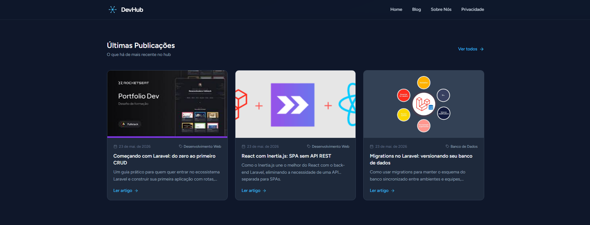
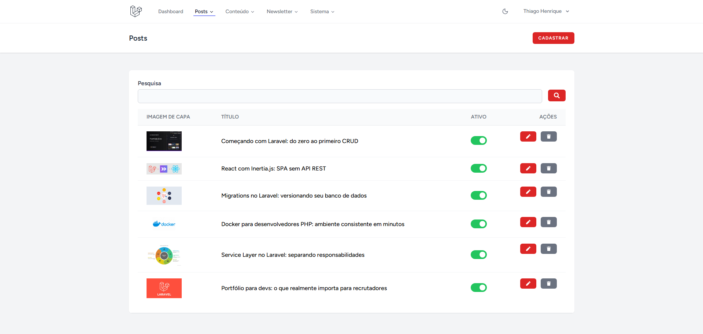
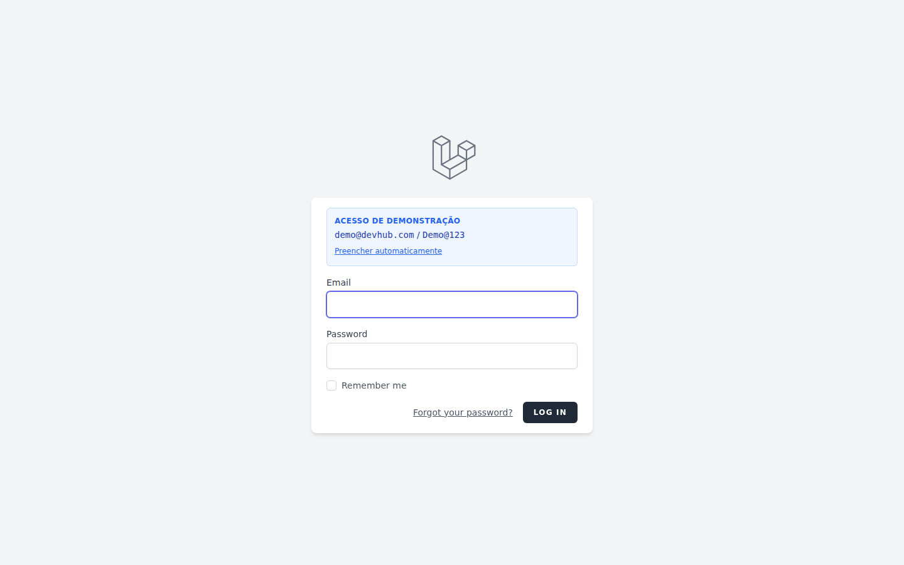

# DevHub

CMS full-stack construído do zero com Laravel 13 + React 18 — painel administrativo completo, API RESTful autenticada com Sanctum, sistema de newsletter com conformidade LGPD e frontend público com roteamento dinâmico.

> **Demo ao vivo:** [devhub-production-a6a5.up.railway.app](https://devhub-production-a6a5.up.railway.app) · **Admin:** [/admin](https://devhub-production-a6a5.up.railway.app/admin) (credenciais: `demo@devhub.com` / `Demo@123` — acesso somente leitura)

## Stack

| Camada | Tecnologia |
|--------|-----------|
| Backend | PHP 8.3 + Laravel 13 |
| Frontend | React 18 + Inertia.js |
| Editor de texto | TipTap |
| Estilização | Tailwind CSS 3 |
| Build | Vite 8 |
| Banco de dados | MySQL 8 |
| Cache / Queue broker | Redis |
| Autenticação API | Laravel Sanctum |
| Filas assíncronas | Laravel Queue (driver: database) |
| Infra | Docker + Nginx |
| Deploy | Railway |

## Funcionalidades

### Frontend público
- Homepage com posts em destaque e listagem paginada
- Página individual de post com prose rendering
- Listagem de posts por categoria
- Menu de navegação dinâmico com suporte a submenus
- Banner de privacidade (LGPD)
- Formulário de newsletter com consentimento explícito (LGPD)

### Painel administrativo
- **Posts** — CRUD completo com editor rich-text (TipTap), upload de banner, slug automático, toggle ativo/inativo
- **Páginas** — CRUD de páginas estáticas com banner, imagem principal, galeria de fotos e campos de SEO
- **Categorias** — CRUD com cor customizável
- **Blocos de conteúdo** — trechos de HTML reutilizáveis identificados por slug
- **Tecnologias** — vitrine de ferramentas com ícone, screenshot e link, reordenáveis
- **Menu** — gerenciamento de itens de navegação com suporte a hierarquia pai/filho e reordenação
- **Configurações** — painel centralizado para nome do site, tagline, redes sociais, contato e scripts de terceiros
- **Newsletter** — áreas temáticas, inscritos com consentimento LGPD e campanhas de e-mail
- **Permissões e Papéis** — controle de acesso baseado em papéis (via Spatie Laravel Permission)
- **Usuários** — gerenciamento de usuários e atribuição de papéis
- **Log de atividades** — histórico de ações com diff de alterações (via Spatie Activity Log)

### Sistema de Newsletter
- Inscrição com consentimento explícito: checkbox obrigatório (não pré-marcado), finalidade clara no formulário
- Consentimento armazenado com timestamp (LGPD)
- Link de descadastro funcional por token único em todos os e-mails
- Campanhas vinculadas a posts do blog — o admin seleciona quais posts compõem cada edição
- Envio assíncrono via Laravel Queue com log individual por inscrito
- Agendamento de campanhas com scheduler automático
- Poda automática de logs após 6 meses (minimização de dados — LGPD)

### API RESTful
- Autenticação via Bearer token (Laravel Sanctum)
- Documentação Swagger UI disponível em `/api/docs`
- Cache Redis em todos os endpoints com invalidação automática por observers

| Método | Endpoint | Descrição |
|--------|----------|-----------|
| `POST` | `/api/auth/login` | Autenticação e geração de token |
| `POST` | `/api/auth/logout` | Revogação do token |
| `GET` | `/api/auth/me` | Dados do usuário autenticado |
| `GET` | `/api/posts` | Lista posts ativos (paginado) |
| `GET` | `/api/posts/{slug}` | Retorna um post pelo slug |
| `GET` | `/api/categories` | Lista categorias |
| `GET` | `/api/pages/{slug}` | Retorna uma página |
| `GET` | `/api/menu` | Estrutura do menu |

## Arquitetura

```
app/
├── Console/Commands/
│   ├── DispatchScheduledNewsletters.php  # Verifica campanhas agendadas (roda a cada minuto)
│   └── GenerateApiToken.php
├── Http/
│   ├── Controllers/
│   │   ├── Admin/        # 18 controllers (Posts, Pages, Categories, Blocks,
│   │   │                 # Technologies, Menu, Configs, Users, Roles,
│   │   │                 # NewsletterAreas, NewsletterSubscribers,
│   │   │                 # NewsletterCampaigns, ActivityLog, Gallery…)
│   │   ├── Api/          # AuthController, PostController, CategoryController,
│   │   │                 # PageController, MenuController
│   │   └── BlogController, HomeController, NewsletterController
│   ├── Middleware/
│   │   ├── EnsureAdmin.php
│   │   └── ResourcePermission.php
│   └── Requests/         # Form Requests por recurso
├── Jobs/
│   └── SendNewsletterCampaign.php   # Processamento assíncrono de campanhas
├── Mail/
│   └── NewsletterCampaignMail.php
├── Models/               # Post, Page, GalleryImage, Category, Block, Technology,
│                         # MenuItem, Config, User, Role,
│                         # NewsletterArea, NewsletterSubscriber,
│                         # NewsletterCampaign, NewsletterSendLog
├── Services/             # PostService, PageService, MenuService, RoleService,
│                         # UserService, ConfigService, ActivityLogService,
│                         # FileUploadService
└── Traits/
    └── HasActivityLog.php
```

O projeto segue o padrão **Controller → Service → Eloquent**: controllers são finos e delegam lógica de negócio para services. CRUD simples usa Eloquent direto no controller. Dados da API passam por Resources para serialização consistente.

## Decisões técnicas

**Service layer em vez de Repository pattern**
O Repository pattern adiciona uma camada de abstração que só se justifica quando você precisa trocar o mecanismo de persistência. Aqui, o banco é MySQL e o ORM é Eloquent — fixos. A camada de Service existe apenas onde há lógica de negócio genuína: orquestração de múltiplos models, transações, upload de arquivos.

**Inertia.js em vez de API + SPA separado**
O painel administrativo não precisa de uma API própria — é uma interface que consome os mesmos dados do backend. Inertia.js permite escrever o frontend em React com roteamento e estado gerenciados pelo Laravel, sem duplicar a camada de autenticação e autorização. A API RESTful existe separada para consumo externo.

**Sanctum para autenticação da API**
Tokens stateless gerados pelo próprio Laravel, sem dependência de pacote externo de JWT. O `personal_access_tokens` do Sanctum integra com o ecossistema Laravel nativamente e suporta revogação individual de tokens.

**Queue assíncrona para campanhas de newsletter**
O envio de e-mails para múltiplos inscritos é feito via Job enfileirado (Laravel Queue, driver `database`), evitando timeout na requisição HTTP e possibilitando retry automático em caso de falha. O worker roda em background no mesmo container via `start.sh`.

**Spatie Permission e Activity Log**
Controle de acesso baseado em papéis (RBAC) e log de auditoria são problemas resolvidos. Os pacotes Spatie são padrão de mercado em projetos Laravel.

**Redis para cache da API**
Todos os endpoints da API têm resposta cacheada no Redis com invalidação automática via Observers — a cada create/update/delete, o cache do recurso afetado é limpo, sem necessidade de TTL artificial.

**SQLite in-memory para testes**
Os testes de feature cobrem comportamento de rotas e regras de negócio, não detalhes de SQL. SQLite in-memory elimina a dependência de banco real, torna os testes rápidos e garante isolamento entre suítes.

## Screenshots

### Frontend público

*Homepage com listagem de posts por categoria*


*Página de post com rich-text e metadados*

### Painel administrativo

*Gerenciamento de posts com toggle ativo/inativo e busca*


*Tela de login com acesso de demonstração*

## Pré-requisitos

- Docker e Docker Compose
- Node.js 22.12+ no host (o container `app` não tem Node — o Vite roda no host)
  - Use `nvm use 22` se tiver o NVM instalado

## Setup

### 1. Clone e configure o ambiente

```bash
git clone <url-do-repo>
cd devhub
cp .env.example .env
```

Confirme as variáveis do banco no `.env`:

```env
DB_HOST=db
DB_PORT=3306
DB_DATABASE=app_db
DB_USERNAME=user
DB_PASSWORD=secret
```

### 2. Suba os containers

```bash
docker compose up -d
```

### 3. Instale dependências PHP e prepare o banco

```bash
docker exec app composer install
docker exec app php artisan key:generate
docker exec app php artisan migrate
docker exec app php artisan storage:link
```

### 4. Instale dependências Node e gere os assets

```bash
# Rodar no host (não no container)
nvm use 22
npm install
npm run build
```

### 5. (Opcional) Popule com dados de exemplo

```bash
docker exec app php artisan db:seed
```

Isso cria:
- 1 usuário admin (`thiago@teste.com.br` / `Senha@123`)
- 6 categorias e 6 posts com imagens
- Páginas "Sobre Nós" e "Política de Privacidade"
- 8 tecnologias e áreas de newsletter
- Configurações do site e menu de navegação completo

### 6. Configure o host local

Adicione ao seu `/etc/hosts`:

```
127.0.0.1   devhub.local
```

Acesse em **http://devhub.local** e o painel em **http://devhub.local/admin**

### 7. (Opcional) Inicie filas e scheduler para o sistema de newsletter

```bash
# Queue worker — processa campanhas de e-mail
docker exec app php artisan queue:work

# Scheduler — despacha campanhas agendadas a cada minuto
php artisan schedule:work   # roda no host
```

## Containers

| Container | Função | Porta |
|-----------|--------|-------|
| `app` | PHP-FPM (Laravel) | — |
| `webserver` | Nginx | 80 |
| `db` | MySQL 8 | 3307 (host) |
| `redis` | Cache + Queue | 6379 (host) |

## Comandos úteis

```bash
# Migrations
docker exec app php artisan migrate

# Acessar o banco pelo host
mysql -h 127.0.0.1 -P 3307 -u user -psecret app_db

# Frontend — dev server com hot reload (rodar no host)
nvm use 22
npm run dev

# Frontend — build de produção (rodar no host)
npm run build

# Rodar testes
docker exec app php artisan test
```

## Testes

Os testes usam SQLite in-memory e não afetam o banco de desenvolvimento.

```bash
docker exec app php artisan test
```

**Resultado atual: 124 testes, 443 asserções — 100% passando**

Cobertura por módulo:

| Módulo | Testes |
|--------|--------|
| API (auth, posts, paginação, slug, 404) | `Api/PostApiTest`, `Api/ValidateApiTokenTest` |
| Admin — Posts | CRUD completo, upload de banner, permissões |
| Admin — Categories, Blocks, Pages, Technologies | CRUD e permissões |
| Admin — Menu | CRUD e reordenação |
| Admin — Newsletter areas e subscribers | CRUD e conformidade |
| Admin — Roles e Users | Criação, proteção de perfis de sistema, controle de super admin |
| Admin — Reorder | Transações e validação de módulos |
| Auth | Login, registro, reset de senha, verificação de e-mail |
| Perfil | Atualização e exclusão de conta |
| Models | Limpeza de arquivos em Posts, Pages e GalleryImages |
| Services | PostService (criação, atualização, deleção, upload) |

## Variáveis de ambiente relevantes

| Variável | Descrição |
|----------|-----------|
| `APP_URL` | URL base da aplicação |
| `DB_*` | Conexão com MySQL |
| `REDIS_URL` | Conexão com Redis (cache e filas) |
| `CACHE_STORE` | Driver de cache (`redis` em produção) |
| `QUEUE_CONNECTION` | Driver de fila (`database` em produção) |
| `MAIL_*` | Configuração SMTP para envio de newsletters |
| `FILESYSTEM_DISK` | Disco para upload de arquivos (padrão: `public`) |
